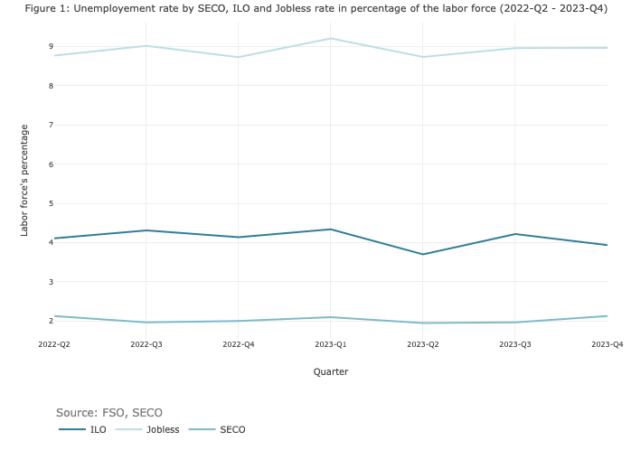
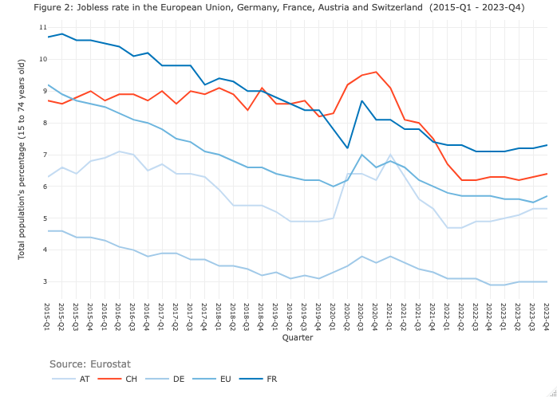

## Introduction

In macroeconomic theory, unemployment is a key factor. Despite the waning economic significance attributed to it with the rise of monetarism, which shifted focus from combating unemployment to combating inflation, economists still closely scrutinize its value. For instance, Blanchard's recent macroeconomic manual positions unemployment as one of the key indicators of economic performance, trailing closely behind growth[^1].

[^1]: Blanchard, O (2020). Macroeconomics, Global edition. 8th edition, Pearson.

This economic variable holds heightened importance within the Swiss context. As elucidated in two recent articles[^2], Switzerland appears to be excelling, nearing full employment. This exceptional scenario, a rarity on the global stage, is sometimes perceived as nearly miraculous. Certain authors in academic literature even go as far as labeling it a « miracle »[^3], solidifying Switzerland's low unemployment rate as an established and undisputed fact.

[^2]: <https://www.rts.ch/info/economie/14453073-avec-un-taux-de-chomage-de-2-on-peut-parler-de-plein-emploi-en-suisse.html> ; <https://www.rts.ch/info/economie/2024/article/plein-emploi-la-detresse-de-ceux-qui-ne-trouvent-pas-28475514.html>.

[^3]: Merrien, F. X., & Becker, U. (2005). The Swiss miracle: Low growth and high employment. Employment 'Miracles': A critical comparison of the Dutch, Scandinavian, Swiss, Australian and Irish cases versus Germany and the US, 113-132; Siegenthaler, M., Graff, M., & Mannino, M. (2014). The Swiss' Job Miracle'.

Contrary to this prevailing narrative, the subsequent analysis critically examines the success of Switzerland's unemployment rate. While Switzerland indeed possesses unique characteristics compared to international counterparts, the following discussion delves into the concept of unemployment and the manner in which statistics rationalize it. Thus, it sidesteps the analysis of the causes and consequences of unemployment trends and instead focuses on the question of what unemployment signifies and how it is measured in the Swiss context.

## Unemployment: A numeric entity or a social and historical construct?

To begin with, it proves beneficial to establish a definition and comprehension of unemployment. In economics, unemployment is often quantified through the unemployment rate, defined as « the number of people who do not have a job but are looking for one »[^4]. Assuming the labor force ($L$) comprises employment ($N$) and unemployment ($U$) (1), the unemployment rate ($u$) is calculated as the ratio of the number of unemployed individuals (2)[^5]:

[^4]: Blanchard (2020), p.45.

[^5]: ibidem.

$$
L = N + U \quad \text{(1)}
$$

$$
u = \frac{U}{L} \quad \text{(2)}
$$

While this definition may appear straightforward, Blanchard cautions that « the unemployment rate is less obvious than it might seem »[^6].

[^6]: ibidem, p.46.

From a slightly different perspective, unemployment is sometimes conceptualized as « a historical and social construct specific to our Western societies... the result of a process that took place mainly at the end of the nineteenth century, at the beginning of the twentieth century and in the thirties »[^7]. Within this political-economic framework, unemployment is neither self-evident nor static. Its measurement and definition fluctuate based on the evolution of the productive economic landscape, and the prevailing economic policies of a given era[^8].

[^7]: Gautié, J. (2002). De l'invention du chômage à sa déconstruction. Genèses, (2), 60-76, p.60.

[^8]: ibidem.

Furthermore, unemployment is, in itself, a legal standard that varies significantly from one country to another and evolves over time in response to political decisions[^9]. Unlike the other, this perspective highlights, therefore, the challenge that lies behind its measurement.

[^9]: ibidem; Gautié, J. (2023). The rise and demise of unemployment. In Handbook of Labour Market Policy in Advanced Democracies (pp. 14-26). Edward Elgar Publishing.

## Unemployment rates and measurement issues

Given the aforementioned complexities and the intricate nature of paid employment (including internships, outsourcing, mandates) and forms of inactivity not encompassed in traditional unemployment metrics (such as underemployment, school dropout rates, reliance on social assistance, etc.), few economists subscribe to the existence of a singular true unemployment figure. Despite the adoption of a common unemployment definition by all countries since 1982 through the International Labour Organization (ILO), according to Sheldon, an economics professor at Basel University, « there's no such thing as a "true" unemployment number »[^10]. The ILO definition allows indeed for considerable maneuvering, rendering international comparisons challenging[^11] and proving unsuitable for non-Western contexts[^12].

[^10]: <https://dievolkswirtschaft.ch/fr/2020/09/sheldon-10-2020fr/>.

[^11]: Gautié, J. (2023).

[^12]: Benanav, A. (2019). The origins of informality: the ILO at the limit of the concept of unemployment. Journal of Global History, 14(1), 107-125.

Consequently, alternative indicators have emerged. While the number of measures varies by country, Switzerland primarily employs three main metrics[^13]. **Figure 1** below illustrates the disparity between these metrics, showcasing the variation in unemployment rates between the second quarter of 2022 and the fourth quarter of 2023. Throughout this period, the ILO unemployment rate consistently exceeds that reported by the State Secretariat for Economic Affairs (SECO). Notably, the jobless rate, which includes underemployment, stands significantly higher than both. The jobless rate is on average 102% higher than the indicator calculated according ILO's definition and 338% higher than that of the SECO.

[^13]: The employment rate is also increasingly used as an alternative measure to the unemployment rate. In this article, however, we consider that it is not really an unemployment rate as its name suggests.

The discrepancies stem chiefly from variations in definitions and measurement methodologies employed by these indicators. SECO's metric, a widely recognized measure used for economic policymaking, relies on the number of individuals registered as unemployed with employment offices at month-end. Despite its monthly publication advantage, this metric suffers from a notable weakness: individuals without a compelling reason to register, such as those who have exhausted their unemployment benefits, likely abstain from visiting employment offices, thereby remaining uncounted. This registration-based measurement, prevalent internationally, remains susceptible to legal modifications. As noted by Blanchard, « in countries with less generous benefit systems, fewer unemployed individuals are likely to register, resulting in lower measured unemployment rates »[^14].

[^14]: Blanchard (2020), p. 46.

To address these issues and enhance cross-country comparability, metrics aligned with the ILO definition have been developed by the Federal Statistical Office of Switzerland (FSO). Unlike SECO's metric, which relies on registered individuals, this approach utilizes survey data, capturing the entirety of the resident population, published quarterly. While this methodology captures unregistered unemployment, its statistical accuracy may be compromised due to its survey nature.

Lastly, the jobless rate, published by the FSO, transcends mere non-employment by incorporating individuals seeking increased work percentage, i.e. underemployment. This measure, known as the underemployment rate, is added to the ILO unemployment rate to derive the jobless rate.

## An unsuccessful unemployment rate?

While the rate calculated by SECO appears to be particularly performant, despite the methodological limitations already mentioned, a comparison of the jobless rate at European level paints an entirely different picture. **Figure 2** shows an approximation of the quarterly jobless rate between 2015 and 2023 for the European Union, Germany, France, Austria and Switzerland. This is an approximation, as the rate is generally calculated as a percentage of the labor force. For reasons of comparability and data availability, it has only been possible to extract data as a percentage of the total population, which explains the differences between the figures for Switzerland in Figures 1 and 2. These data come from Eurostat and have been calculated according to the following equation (3):

$$ J_t = I_t + U_{nt} \quad \text{(3)} $$

where

-   $J_t$: The jobless rate, expressed as a % of the total population, covering ages 15 to 74, for a quarter \$t\$.
-   $I_t$: Harmonized unemployment rate according to the ILO definition, expressed as a % of the total population, seasonally adjusted, covering ages 15 to 74, for a quarter\$t\$.
-   $U_{nt}$: Underemployment rate expressed as a % of the total population, seasonally adjusted, covering ages 15 to 74, for a quarter \$t\$.

Despite the limits to the comparability of data due to the weaknesses of harmonization, **Figure 2** provides a major lesson: the approximate unemployment rate, captured by the jobless rate, will underperform Austria and Germany from 2015 to 2023. With the exception of the first two quarters of 2015, the Swiss unemployment rate is even higher than for the European Union as a whole. Switzerland only performs better than France, but this is not even true for the whole period, since France performs better in the last quarter of 2018, the third quarter of 2019, and all quarters of 2020 and 2021. As a result, Switzerland does not appear to be performing any better than the rest of Europe. In fact, compared with the European Union, Austria and Germany, it appears to be underperforming over the 2015-2023 period.

## The politics behind performance or why a very 'low'' unemployment is not very likely

Having demonstrated that the unemployment rate may not necessarily denote success depending on the indicator employed, it's pertinent to assert that any extreme moderate figure appears not very plausible. In a simplified model structured around the capital-labor conflict, achieving full employment becomes inherently challenging. According to a Kaleckian model, unemployment serves as a disciplinary tool for workers, introducing job insecurity as a means of exerting control and tilting the balance of power[^15]. Without unemployment, workers would possess greater leverage to demand wage increases and switch jobs at their discretion. In an economy prioritizing the interests of capital, full employment emerges as counterproductive. This begs the question: does Switzerland operate as an economy organized around labor ?

[^15]: Kalecki, M. (1943). Political aspects of full employment.

The answer is unequivocally no. As recent wage statistics show, real wages in Switzerland have fallen in recent years[^16]. This isn't to suggest that certain sectors may not exhibit favorable power dynamics for workers, but rather that, on average, it appears highly improbable that all workers benefit from favorable power relations in Switzerland.

[^16]: <https://www.bfs.admin.ch/bfs/fr/home/statistiques/travail-remuneration/salaires-revenus-cout-travail/indice-salaires.html>.

## Conclusion

In conclusion, the examination of Switzerland's unemployment rate reveals a nuanced narrative that challenges the prevailing perception of its economic success. While Switzerland indeed boasts low unemployment rates, our analysis uncovers inherent complexities and disparities in both its measurement and interpretation.

Moreover, this article emphasizes the necessity of understanding how unemployment is defined and measured to comprehend its causes, consequences, and potential solutions fully. It does not aim to discredit the validity of existing metrics but rather to shed light on the limitations of their interpretation. Particularly noteworthy is the recognition that unemployment figures represent averages, often obscuring significant variations when analyzed across different social and economic categories[^17].

[^17]: Unemployment rate for all three metrics is consistently higher for women and foreigners, and in some cases for young people.

Ultimately, delving into Switzerland's unemployment rate serves as a crucial reminder of the intricate nature of economic indicators and the importance of contextualizing their analysis within broader socio-political frameworks. By moving beyond surface-level statistics, we attain deeper insights into the complexities of economic performance and the underlying forces that shape our economic system and influence our perceptions of it. Noteworthy studies have, for example, highlighted correlations between fluctuations in the unemployment rate and shifts in government popularity[^18] and partisan voting patterns[^19]. Hence, it's crucial to view unemployment not just as a straightforward statistic, but as a dynamic measure with political implications.

[^18]: Cohen, J. E., & King, J. D. (2004). Relative unemployment and gubernatorial popularity. The Journal of Politics, 66(4), 1267-1282; Ansolabehere, S., Meredith, M., & Snowberg, E. (2014). Mecro‐economic voting: Local information and micro‐perceptions of the macro‐economy. Economics & Politics, 26(3), 380-410.

[^19]: Wright, J. R. (2012). Unemployment and the democratic electoral advantage. American Political Science Review, 106(4), 685-702; Brännlund, A. (2021). Labor market conditions and partisan voting: How unemployment hurts the left. Political Behavior, 43(1), 363-396.
